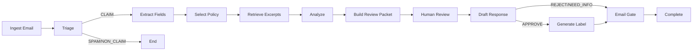

# Warranty Claims Agent

> [!TIP]
> **Quick Start (Windows)**: double-click `run_app.bat`.
> It will install dependencies, initialize the vector DB, and launch the app.

An AI-powered warranty claims processing system with human-in-the-loop review for HairTech Industries.

## Quick Start

### One-Click Run (Recommended)
```cmd
run_app.bat
```

### Manual Run
```bash
# 1. Install dependencies
pip install -r requirements.txt

# 2. Setup environment
copy .env.example .env

# 3. Build database (first time only)
python index_db.py

# 4. Run App
streamlit run ui/streamlit_app.py
```

---

## LLM Providers

### Local (Ollama)
- Install Ollama: https://ollama.com/
- Example: `ollama run qwen2.5:1.5b`
- Default in `.env`: `USE_OLLAMA=true`

### Cloud Providers (UI Selector)
Use the **LLM Provider** panel in the sidebar to select a provider and apply your API key.
- Groq: `GROQ_API_KEY`
- Gemini: `GOOGLE_API_KEY`
- OpenAI: `OPENAI_API_KEY`

If **Remember key on this machine** is checked, the key is saved to `.env` (local only).
If no provider is available, the UI runs in **View-Only Mode** and disables processing.

---

## Project Structure

```
Claims_Agent/
- app/
  - main.py           # CLI entry point
  - graph.py          # LangGraph workflow
  - state.py          # ClaimState TypedDict
  - llm.py            # LLM client (Ollama/Groq/Gemini/OpenAI)
  - nodes/            # Workflow nodes
- ui/
  - streamlit_app.py  # Human review interface
- data/
  - inbox/            # 15 sample claim emails
  - policies/         # 10 warranty policy docs
  - chroma_db/        # Local vector store (auto-created)
  - products.json     # Product catalog
  - testset.jsonl     # Evaluation test set
- outbox/             # Generated outputs (created on run)
- reports/
  - report.md
- index_db.py
- evaluate.py
- performance_test.py
- test_rag_node.py
- requirements.txt
- README.md
```

---

## Workflow



---

## Email Classification (Triage)

Every incoming email is classified into one of three categories using LLM analysis:

| Category | Description | Action |
|----------|-------------|--------|
| **CLAIM** | Valid warranty claim request | Proceed to extraction and analysis |
| **NON_CLAIM** | Product inquiry, general question | Optionally draft helpful response, then archive |
| **SPAM** | Promotional, phishing, or irrelevant | Archive immediately |

**Classification Signals:**
- Mentions of product defects, malfunctions, or issues → CLAIM
- Requests for product information, recommendations → NON_CLAIM
- Promotional language, suspicious links, unrelated content → SPAM

---

## Claim Validation Logic

Claims are validated using a **3-layer approach** combining deterministic rules and LLM reasoning:

### Layer 1: Warranty Window Check (Deterministic)
```
IF purchase_date is missing → NEED_INFO
IF (today - purchase_date) > 90 days → REJECT (warranty expired)
ELSE → Continue to next layer
```

### Layer 2: Exclusion Keywords (Deterministic)
The system scans the email body for policy-specific exclusion triggers:

| Exclusion Type | Example Keywords | Result |
|----------------|------------------|--------|
| **Water Damage** | "water", "liquid", "spill", "bath" | REJECT |
| **Commercial Use** | "salon", "commercial", "business" | REJECT |
| **Physical Damage** | "dropped", "cracked", "broken screen" | REJECT |
| **Unauthorized Repair** | "opened", "modified", "third-party" | REJECT |

> **Note:** Exclusion keywords are loaded from `data/policies/index.json` per product.

### Layer 3: LLM Analysis (Reasoning)
For claims that pass deterministic checks, the LLM analyzes:
- **Issue Description**: Is this a manufacturing defect or user error?
- **Policy Excerpts**: Does the reported issue fall under coverage?
- **Evidence Provided**: Is there proof of purchase, serial number, photos?

**Output Structure:**
```json
{
  "recommendation": "APPROVE | REJECT | NEED_INFO",
  "confidence": 0.0 - 1.0,
  "facts": ["Purchased Jan 10, 2026", "Serial: PS3K-2025-78542"],
  "assumptions": ["Customer used product as intended"],
  "reasoning": "Defect appears to be manufacturing-related..."
}
```

---

## Key Assumptions

| Assumption | Rationale |
|------------|-----------|
| **3-month warranty window** | Standard warranty period for all HairTech products |
| **One product per email** | Simplifies extraction; multi-product claims would need human triage |
| **Purchase date from email body** | We do NOT use the email sent date as purchase date |
| **Attachments are mocked** | OCR not implemented; attachment names indicate proof exists |
| **Serial number required** | Essential for warranty verification |
| **US-based returns** | Return labels assume domestic shipping |

---

## What Triggers Each Decision

| Decision | Conditions |
|----------|------------|
| **APPROVE** | Within warranty + No exclusions + Valid defect + Has proof |
| **REJECT** | Warranty expired OR Exclusion matched OR Ineligible issue |
| **NEED_INFO** | Missing: serial number, purchase date, proof of purchase, or detailed description |

---

## UI Highlights

- **Inbox Dashboard**: KPI cards for real-time tracking of pending vs. processed claims.
- **Streamlined Review Interface**: Consolidated view for Executive Summary, Evidence/Policy, and Original Email.
- **Interactive Decision Form**: One-click Approve/Reject/Need Info with reviewer notes.
- **Return Label Integration**: In-app PDF generation and attachment for approved claims.
- **Advanced State Transitions**:
    - **Resume Workflow**: Quickly pick up claims that are "READY TO SEND".
    - **Revise Decision**: Change your mind even at the final dispatch stage.
    - **Active Cancellation**: Cancelled dispatches return to the inbox "Pending" state for re-processing.
- **Claim History**: Full-text searchable database of all past decisions.
- **Non-Claim Handling**: Draft and send courteous responses for inquiries or spam.

---

## CLI Usage

```bash
# List inbox emails
python app/main.py --list

# Process a specific claim
python app/main.py --process claim_001

# Run test mode (auto-approve first email)
python app/main.py --test --auto-approve

# Watch inbox continuously (polling)
python app/main.py --watch --interval 15 --auto-approve
```

---

## Configuration

Environment variables (`.env`):
```bash
# Option 1: Ollama (LOCAL - no API key needed)
USE_OLLAMA=true
OLLAMA_MODEL=qwen2.5:1.5b

# Option 2: Groq (CLOUD - fast inference)
GROQ_API_KEY=your_groq_key
GROQ_MODEL=llama-3.3-70b-versatile

# Option 3: Gemini (CLOUD - fallback)
GOOGLE_API_KEY=your_gemini_key
GEMINI_MODEL=gemini-2.0-flash

# Option 4: OpenAI (CLOUD - general purpose)
OPENAI_API_KEY=your_openai_key
OPENAI_MODEL=gpt-4o-mini

# RAG Embeddings
# Use hash to avoid external downloads. Default uses SentenceTransformer if available.
EMBEDDING_MODE=hash
EMBEDDING_MODEL=all-MiniLM-L6-v2
```

Priority (auto mode): Ollama > Groq > Gemini. OpenAI is available via the provider selector.

---

## Evaluation

### Test Set
See `data/testset.jsonl` for labeled test cases.

Run the evaluator:
```bash
python evaluate.py
python evaluate.py --limit 5
python evaluate.py --ids claim_001,claim_003
```

Latest evaluation (Ollama qwen2.5:1.5b):
- Score: 15/15 (100.0%)
- Triage Accuracy: 100.0%
- Decision Accuracy (claims only): 100.0%
- Coverage (approve/reject): 66.7%
- Avg Confidence (claims only): 0.90

---

## Testing

Run unit and integration tests:
```bash
python -m pytest tests/
```

---

## Validation & Performance

- **Accuracy**: 100% on the labeled test set (15/15 cases).
- **Triage**: 100% correct classification of CLAIM/NON_CLAIM/SPAM.
- **Decision**: 100% agreement with expected outcomes on all claim types.
- **Reliability**: Workflow state is persistent and stable across manual revisions and cancellations.
- **Latency**: Sub-second triage; 2-5s for full extraction and analysis (varies by model).

See full reports: `reports/report.md` and `reports/final_validation.md`

---

## Contact

Sasidhar Yepuri
Email: yepuri.sasi07@gmail.com
